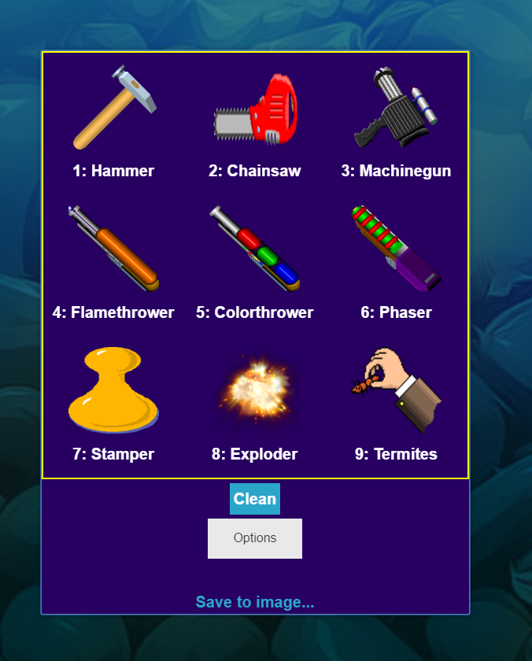
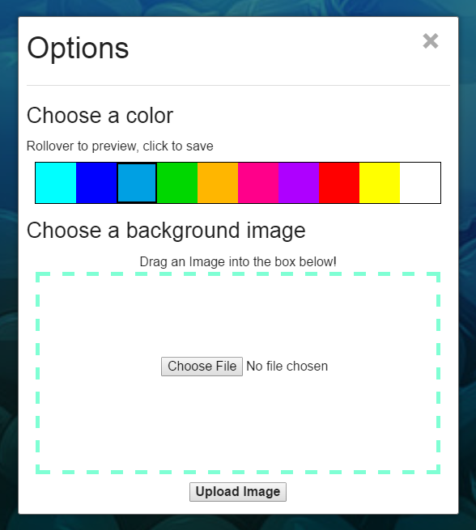
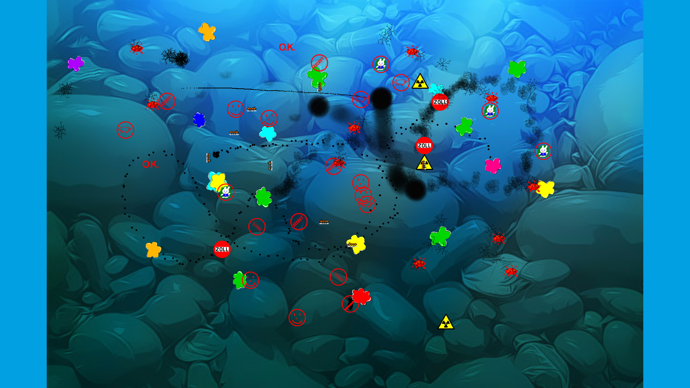

# <a href="http://stress-relief.heroku.com/" target="\_blank">Live Demo</a>

Stress Relief is a responsive CoffeeScript app written using the graphical library PIXI.js. Stress Relief allows users to upload images and decorate the image with a variety of interactive tools. 

Stress Relief is written in [CoffeeScript](http://coffeescript.org/) and compiled to JavaScript, and is powered by [Node.js](https://nodejs.org/), [Jade](http://jade-lang.com/), [Express.js](http://expressjs.com/), [Foundation](http://foundation.zurb.com/), and [Howler](http://goldfirestudios.com/blog/104/howler.js-Modern-Web-Audio-Javascript-Library).

Stress Relief uses the HTML5 canvas to allow for art and images to be drawn to the image.

It is an HTML5 open-source remake of [Gemtree’s](http://www.gemtree.com/) [Desktop Destroyer software](http://publisher.games.brothersoft.com/gemtree-software-total-download/)

#### Main screen
You can select any tool from the menu to decorate the image

#### Options screen
You can roll the mouse over any color and choose a background color. Click one to apply it.

You can also drag a picture or click choose file to browse your computer for an image to upload.

And draw on your image

---

##### To run, execute

<code>
./deploy.sh
</code>

and visit <a href="http://localhost:3000" target="\_blank">localhost:3000</a> in your web browser

---

Legal: [View License](/LICENSE)
